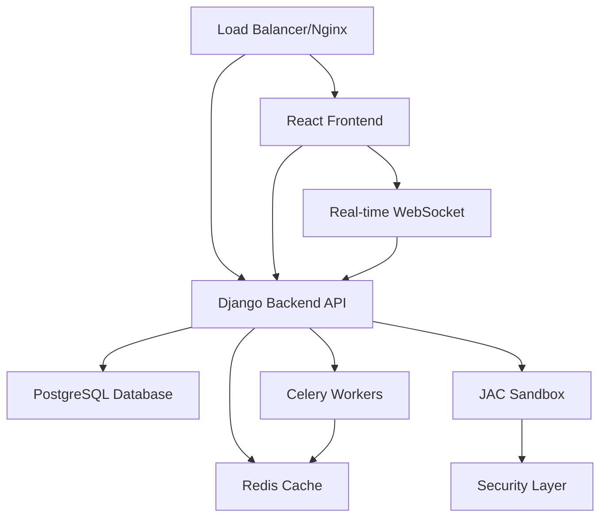

# JAC Interactive Learning Platform - Production Deployment Guide

**Version:** 2.0.0  
**Author:** Cavin Otieno  
**Generated:** 2025-11-21 23:18:30  
**Contact:** cavin.otieno012@gmail.com | +254708101604 | [LinkedIn](https://www.linkedin.com/in/cavin-otieno-9a841260/) | [WhatsApp](https://wa.me/254708101604)  
**Repository:** [github.com/OumaCavin/jac-interactive-learning-platform](https://github.com/OumaCavin/jac-interactive-learning-platform)  

## 🏗️ Architecture Overview

The JAC Interactive Learning Platform is a complete full-stack application with three integrated phases:

### System Components



#### Core Services

| Service | Port | Description | Technology |
|---------|------|-------------|------------|
| **Frontend** | 80 | React SPA with glassmorphism UI | React 18 + TypeScript |
| **Backend API** | 8000 | REST API with JWT auth | Django 4.2 + DRF |
| **Database** | 5432 | Primary data store | PostgreSQL 15 |
| **Cache** | 6379 | Session & task queue | Redis 7 |
| **JAC Sandbox** | 8080 | Secure code execution | Python + Docker |
| **Nginx** | 80/443 | Reverse proxy & load balancer | Nginx Alpine |

## 🚀 Quick Start

### Prerequisites

- **Docker** 20.10+ and **Docker Compose** 2.0+
- **Minimum 8GB RAM** and **10GB disk space**
- **Git** for version control

### One-Command Deployment

```bash
git clone <repository-url>
cd jac-learning-platform
chmod +x deploy.sh
./deploy.sh
```

**Access the application at:** http://localhost

### Demo Credentials

| Role | Email | Password | Access Level |
|------|-------|----------|--------------|
| Admin | admin | admin123 | Full system access |
| Demo User | demo@example.com | demo123 | Learning features |

## 📋 Detailed Deployment

### Step 1: Environment Configuration

The deployment script automatically creates a `.env` file with secure defaults:

```bash
# .env (Auto-generated)
SECRET_KEY=secure-random-key-here
REDIS_PASSWORD=secure-redis-password
POSTGRES_PASSWORD=secure-db-password
DEBUG=False
DJANGO_SETTINGS_MODULE=config.settings.production
```

**Production Configuration Checklist:**

- [ ] Update `SECRET_KEY` with secure random value
- [ ] Configure `EMAIL_HOST` and credentials
- [ ] Setup SSL certificates for HTTPS
- [ ] Configure `CORS_ALLOWED_ORIGINS` for your domain
- [ ] Add monitoring Sentry DSN
- [ ] Setup backup strategy

### Step 2: Database Setup

The platform automatically:
1. Creates PostgreSQL database and user
2. Runs Django migrations
3. Creates default admin user
4. Sets up initial data

```bash
# Manual database commands (if needed)
docker-compose exec postgres psql -U jac_user -d jac_learning_db
docker-compose exec backend python manage.py createsuperuser
```

### Step 3: Service Architecture

#### Backend Services

**Django API Server**
- Framework: Django 4.2.7 + DRF
- Authentication: JWT with refresh tokens
- Features: Multi-agent system, learning paths, code execution
- Performance: Gunicorn with 4 workers

**JAC Code Execution Sandbox**
- Security: Isolated Docker container
- Limits: 30s timeout, 128MB memory, 1KB output
- Languages: JAC, Python
- Features: Real-time execution, security scanning

**Celery Workers**
- Background tasks: Email, notifications, analytics
- Task queue: Redis-based
- Concurrency: 2 workers per container

#### Frontend Services

**React Application**
- Framework: React 18.2.0 + TypeScript
- State Management: Redux Toolkit + React Query
- UI: Tailwind CSS + Glassmorphism design
- Editor: Monaco Editor with JAC syntax highlighting
- Build: Production-optimized webpack build

**Nginx Reverse Proxy**
- Static file serving with caching
- API request proxying
- WebSocket support for real-time features
- Gzip compression and security headers

### Step 4: Monitoring & Logging

#### Health Checks

All services include health checks:

```bash
# Check service health
curl http://localhost/health
docker-compose ps

# View logs
docker-compose logs -f backend
docker-compose logs -f frontend
docker-compose logs -f postgres
```

#### Log Management

- **Logs Location:** `logs/` directory
- **Rotation:** Daily rotation with 14-day retention
- **Centralized:** All services log to standard output
- **Monitoring:** Health checks every 30 seconds

### Step 5: SSL/HTTPS Setup

#### For Production

1. **Obtain SSL Certificates**

```bash
# Using Let's Encrypt (Certbot)
sudo apt install certbot
sudo certbot certonly --standalone -d yourdomain.com

# Copy certificates
sudo cp /etc/letsencrypt/live/yourdomain.com/fullchain.pem ./nginx/ssl/
sudo cp /etc/letsencrypt/live/yourdomain.com/privkey.pem ./nginx/ssl/
```

2. **Update Nginx Configuration**

```nginx
server {
    listen 443 ssl http2;
    server_name yourdomain.com;
    
    ssl_certificate /etc/nginx/ssl/fullchain.pem;
    ssl_certificate_key /etc/nginx/ssl/privkey.pem;
    
    # SSL configuration
    ssl_protocols TLSv1.2 TLSv1.3;
    ssl_ciphers ECDHE-RSA-AES256-GCM-SHA512:DHE-RSA-AES256-GCM-SHA512;
    ssl_prefer_server_ciphers off;
    
    # Rest of configuration...
}

server {
    listen 80;
    server_name yourdomain.com;
    return 301 https://$server_name$request_uri;
}
```

3. **Update Environment Variables**

```bash
# .env
CORS_ALLOWED_ORIGINS=https://yourdomain.com
FORCE_HTTPS=True
SECURE_SSL_REDIRECT=True
```

## 🔧 Configuration Management

### Environment Variables

| Variable | Description | Default | Required |
|----------|-------------|---------|----------|
| `SECRET_KEY` | Django secret key | Auto-generated | ✅ |
| `DEBUG` | Debug mode | False | ✅ |
| `DATABASE_URL` | Database connection | Auto-configured | ✅ |
| `REDIS_URL` | Redis connection | Auto-configured | ✅ |
| `CORS_ALLOWED_ORIGINS` | CORS origins | localhost | ✅ |
| `EMAIL_HOST` | SMTP server | Not set | ⚠️ |
| `SENTRY_DSN` | Error monitoring | Not set | ⚠️ |

### Django Settings

**Production Settings (`config/settings/production.py`)**

```python
# Security
DEBUG = False
ALLOWED_HOSTS = ['yourdomain.com', 'localhost']

# Database
DATABASES = {
    'default': {
        'ENGINE': 'django.db.backends.postgresql',
        'NAME': os.getenv('DB_NAME'),
        'USER': os.getenv('DB_USER'),
        'PASSWORD': os.getenv('DB_PASSWORD'),
        'HOST': os.getenv('DB_HOST'),
        'PORT': os.getenv('DB_PORT'),
    }
}

# Cache
CACHES = {
    'default': {
        'BACKEND': 'django_redis.cache.RedisCache',
        'LOCATION': os.getenv('REDIS_URL'),
        'OPTIONS': {
            'CLIENT_CLASS': 'django_redis.client.DefaultClient',
        }
    }
}

# Security Headers
SECURE_BROWSER_XSS_FILTER = True
SECURE_CONTENT_TYPE_NOSNIFF = True
SECURE_HSTS_INCLUDE_SUBDOMAINS = True
SECURE_HSTS_SECONDS = 31536000
SECURE_REDIRECT_EXEMPT = []
SECURE_SSL_REDIRECT = os.getenv('FORCE_HTTPS') == 'True'
SESSION_COOKIE_SECURE = True
CSRF_COOKIE_SECURE = True
X_FRAME_OPTIONS = 'SAMEORIGIN'
```

### React Configuration

**Environment Variables (`frontend/.env.production`)**

```bash
REACT_APP_API_URL=https://yourdomain.com/api
REACT_APP_WS_URL=wss://yourdomain.com/ws
REACT_APP_SENTRY_DSN=your-sentry-dsn
```

## 📊 Performance Optimization

### Backend Optimization

1. **Database Indexing**
```sql
-- Learning paths
CREATE INDEX idx_learning_paths_difficulty ON learning_path(difficulty);
CREATE INDEX idx_learning_paths_category ON learning_path(category);

-- User progress
CREATE INDEX idx_user_progress_user ON user_progress(user_id);
CREATE INDEX idx_user_progress_path ON user_progress(learning_path_id);

-- Code executions
CREATE INDEX idx_code_executions_user ON code_execution(user_id);
CREATE INDEX idx_code_executions_created ON code_execution(created_at);
```

2. **Caching Strategy**
```python
# Redis caching
CACHES = {
    'default': {
        'BACKEND': 'django_redis.cache.RedisCache',
        'LOCATION': 'redis://redis:6379/1',
        'OPTIONS': {
            'CLIENT_CLASS': 'django_redis.client.DefaultClient',
            'CONNECTION_POOL_KWARGS': {'max_connections': 50, 'retry_on_timeout': True}
        }
    }
}

# Cache frequently accessed data
@cache_page(60 * 15)  # Cache for 15 minutes
def get_learning_paths():
    return LearningPath.objects.filter(is_active=True)
```

3. **API Optimization**
```python
# Pagination
from rest_framework.pagination import PageNumberPagination

class StandardResultsSetPagination(PageNumberPagination):
    page_size = 20
    page_size_query_param = 'page_size'
    max_page_size = 100

# Selective serialization
class LearningPathSerializer(serializers.ModelSerializer):
    class Meta:
        model = LearningPath
        fields = ['id', 'title', 'difficulty', 'estimated_time', 'progress']
    
    def to_representation(self, instance):
        # Only include full details when requested
        if self.context.get('request').GET.get('detailed') == 'true':
            fields = ['id', 'title', 'description', 'modules', 'difficulty', 'estimated_time', 'progress']
            return super().to_representation(instance)
        return super().to_representation(instance)
```

### Frontend Optimization

1. **Code Splitting**
```javascript
// Lazy loading routes
const Dashboard = lazy(() => import('./pages/Dashboard'));
const CodeEditor = lazy(() => import('./pages/CodeEditor'));
const LearningPaths = lazy(() => import('./pages/learning/LearningPaths'));

// Lazy loading components
const AgentChat = lazy(() => import('./components/AgentChat'));
```

2. **Bundle Optimization**
```javascript
// webpack.config.js
module.exports = {
  optimization: {
    splitChunks: {
      chunks: 'all',
      cacheGroups: {
        vendor: {
          test: /[\\/]node_modules[\\/]/,
          name: 'vendors',
          chunks: 'all',
        },
      },
    },
  },
};
```

3. **Image Optimization**
```javascript
// Use WebP format with fallbacks
 e.target.src = 'image.jpg'} 
  alt="Description"
/>
```

## 🔒 Security Configuration

### Application Security

1. **Input Validation**
```python
# Django forms with validation
class CodeExecutionForm(forms.Form):
    code = forms.CharField(
        widget=forms.Textarea,
        validators=[MaxLengthValidator(1000)]
    )
    
    def clean_code(self):
        code = self.cleaned_data['code']
        # Security scan
        if any(keyword in code.lower() for keyword in ['import os', 'subprocess', 'eval']):
            raise forms.ValidationError("Unsafe code patterns detected")
        return code
```

2. **Rate Limiting**
```python
# API rate limiting
from rest_framework.throttling import UserRateThrottle

class CodeExecutionThrottle(UserRateThrottle):
    scope = 'code_execution'
    rate = '10/hour'  # 10 code executions per hour

@api_view(['POST'])
@throttle_classes([CodeExecutionThrottle])
def execute_code(request):
    # Implementation
    pass
```

3. **CORS Configuration**
```python
# CORS settings
CORS_ALLOWED_ORIGINS = [
    "https://yourdomain.com",
    "https://www.yourdomain.com",
]

CORS_ALLOW_CREDENTIALS = True

CORS_ALLOW_METHODS = [
    'GET',
    'POST',
    'PUT',
    'PATCH',
    'DELETE',
    'OPTIONS',
]

CORS_ALLOW_HEADERS = [
    'accept',
    'accept-encoding',
    'authorization',
    'content-type',
    'dnt',
    'origin',
    'user-agent',
    'x-csrftoken',
    'x-requested-with',
]
```

### Infrastructure Security

1. **Container Security**
```dockerfile
# Non-root user in Dockerfile
RUN groupadd -r appuser && useradd -r -g appuser appuser
RUN chown -R appuser:appuser /app
USER appuser

# Security options
security_opt:
  - no-new-privileges:true
cap_drop:
  - ALL
cap_add:
  - SETGID
  - SETUID
```

2. **Network Security**
```yaml
# Docker network isolation
networks:
  jac_network:
    driver: bridge
    internal: false  # Allow external access
    ipam:
      config:
        - subnet: 172.20.0.0/16
```

## 📈 Monitoring & Analytics

### Application Monitoring

1. **Health Checks**
```python
# Backend health endpoint
@api_view(['GET'])
def health_check(request):
    return Response({
        'status': 'healthy',
        'timestamp': timezone.now(),
        'version': '1.0.0',
        'database': check_database_connection(),
        'redis': check_redis_connection(),
        'agents': check_agent_status()
    })
```

2. **Performance Monitoring**
```python
# Celery task for performance metrics
@app.task
def collect_performance_metrics():
    metrics = {
        'api_response_time': get_average_response_time(),
        'code_executions_per_hour': get_code_execution_count(),
        'active_users': get_active_user_count(),
        'system_load': get_system_load()
    }
    send_metrics_to_monitoring(metrics)
```

3. **Error Tracking**
```python
# Sentry integration
import sentry_sdk
from sentry_sdk.integrations.django import DjangoIntegration

sentry_sdk.init(
    dsn=os.getenv('SENTRY_DSN'),
    integrations=[DjangoIntegration()],
    traces_sample_rate=1.0,
    send_default_pii=True
)
```

### Log Management

1. **Structured Logging**
```python
import structlog

logger = structlog.get_logger()

# Log with context
logger.info("User logged in", user_id=user.id, ip_address=request.remote_addr)
logger.error("Code execution failed", code=code, error=str(e))
```

2. **Log Aggregation**
```yaml
# Docker logging configuration
version: '3.8'
services:
  backend:
    logging:
      driver: "json-file"
      options:
        max-size: "10m"
        max-file: "3"
```

## 🔄 Backup & Recovery

### Database Backup

```bash
#!/bin/bash
# backup.sh

DATE=$(date +%Y%m%d_%H%M%S)
BACKUP_DIR="/backups"

# Create backup
docker-compose exec -T postgres pg_dump -U jac_user jac_learning_db > "$BACKUP_DIR/backup_$DATE.sql"

# Compress backup
gzip "$BACKUP_DIR/backup_$DATE.sql"

# Keep only last 30 days
find "$BACKUP_DIR" -name "backup_*.sql.gz" -mtime +30 -delete

echo "Backup completed: backup_$DATE.sql.gz"
```

### Automated Backup Schedule

```bash
# Add to crontab
0 2 * * * /path/to/backup.sh >> /var/log/backup.log 2>&1
```

### Disaster Recovery

```bash
#!/bin/bash
# restore.sh

BACKUP_FILE="$1"
if [ -z "$BACKUP_FILE" ]; then
    echo "Usage: $0 <backup_file.sql.gz>"
    exit 1
fi

# Stop application
docker-compose down

# Restore database
gunzip -c "$BACKUP_FILE" | docker-compose exec -T postgres psql -U jac_user jac_learning_db

# Start application
docker-compose up -d

echo "Restore completed from $BACKUP_FILE"
```

## 🧪 Testing Strategy

### Automated Testing

1. **Backend Tests**
```bash
# Run all tests
docker-compose exec backend python manage.py test

# Run specific test category
docker-compose exec backend python manage.py test apps.agents
docker-compose exec backend python manage.py test apps.learning

# Run with coverage
docker-compose exec backend coverage run --source='.' manage.py test
docker-compose exec backend coverage report
```

2. **Frontend Tests**
```bash
# Run tests
docker-compose exec frontend npm test -- --coverage

# Run e2e tests (Cypress)
docker-compose exec frontend npm run cypress:run
```

3. **Integration Tests**
```bash
# Full system test
./scripts/integration_test.sh
```

### Load Testing

```bash
# Install Artillery
npm install -g artillery

# Run load test
artillery run load_test.yml

# load_test.yml
config:
  target: 'http://localhost'
  phases:
    - duration: 60
      arrivalRate: 10
scenarios:
  - name: "User Journey"
    weight: 100
    flow:
      - get:
          url: "/"
      - post:
          url: "/api/auth/login/"
          json:
            email: "demo@example.com"
            password: "demo123"
      - get:
          url: "/api/learning/paths/"
      - post:
          url: "/api/learning/execute/"
          json:
            code: "walker init; print('test');"
            language: "jac"
```

## 📚 API Documentation

### Available Endpoints

#### Authentication
```http
POST /api/auth/login/
POST /api/auth/register/
POST /api/auth/refresh/
POST /api/auth/logout/
GET  /api/auth/me/
```

#### Learning Paths
```http
GET    /api/learning/paths/
GET    /api/learning/paths/{id}/
POST   /api/learning/paths/{id}/enroll/
GET    /api/learning/modules/{path_id}/
POST   /api/learning/execute/
POST   /api/learning/evaluate/
GET    /api/learning/progress/
```

#### Multi-Agent System
```http
GET    /api/agents/
POST   /api/agents/create_task/
POST   /api/agents/evaluate_code/
POST   /api/agents/chat/
GET    /api/agents/knowledge_graph/
GET    /api/agents/metrics/
```

### API Response Format

```json
{
  "success": true,
  "data": {
    "id": 1,
    "title": "Example",
    "status": "active"
  },
  "message": "Operation completed successfully",
  "timestamp": "2025-11-21T21:47:32Z"
}
```

## 🎯 Production Checklist

### Pre-Deployment
- [ ] Update all environment variables with production values
- [ ] Configure SSL certificates
- [ ] Setup monitoring and alerting
- [ ] Configure backup strategy
- [ ] Review security settings
- [ ] Test deployment in staging environment

### Post-Deployment
- [ ] Verify all services are healthy
- [ ] Test user registration and login
- [ ] Test code execution functionality
- [ ] Verify email notifications
- [ ] Check API documentation access
- [ ] Monitor error logs
- [ ] Test backup and restore procedures

### Ongoing Maintenance
- [ ] Monitor system resources
- [ ] Review security logs
- [ ] Update dependencies regularly
- [ ] Perform security audits
- [ ] Review and optimize performance
- [ ] Update documentation

## 🆘 Troubleshooting

### Common Issues

**1. Services won't start**
```bash
# Check logs
docker-compose logs [service_name]

# Check disk space
df -h

# Check memory usage
docker stats

# Restart services
docker-compose restart
```

**2. Database connection issues**
```bash
# Check database status
docker-compose exec postgres pg_isready -U jac_user

# Check network connectivity
docker-compose exec backend ping postgres

# Reset database
docker-compose down -v
docker-compose up -d postgres
```

**3. Frontend build issues**
```bash
# Clear node_modules
docker-compose exec frontend rm -rf node_modules package-lock.json
docker-compose exec frontend npm install

# Rebuild frontend
docker-compose build --no-cache frontend
```

**4. Performance issues**
```bash
# Check system resources
htop
docker stats

# Check slow queries
docker-compose exec backend python manage.py showmigrations --list

# Clear cache
docker-compose exec backend python manage.py clear_cache
```

### Emergency Procedures

**Service Recovery**
```bash
# Quick restart
docker-compose restart

# Full restart (clears state)
docker-compose down
docker-compose up -d

# Emergency backup
docker-compose exec postgres pg_dump -U jac_user jac_learning_db > emergency_backup.sql
```

**Rollback**
```bash
# Rollback to previous version
git checkout <previous-commit>
./deploy.sh
```

## 📞 Support & Resources

### Documentation Links
- [Django Documentation](https://docs.djangoproject.com/)
- [React Documentation](https://react.dev/)
- [Docker Documentation](https://docs.docker.com/)
- [PostgreSQL Documentation](https://www.postgresql.org/docs/)

### Monitoring Dashboards
- Application: http://localhost/admin/
- API Docs: http://localhost/api/docs/
- Health Check: http://localhost/health

### Contact Information
- **Technical Lead:** Cavin Otieno  
- **Contact:** cavin.otieno012@gmail.com | +254708101604 | [LinkedIn](https://www.linkedin.com/in/cavin-otieno-9a841260/) | [WhatsApp](https://wa.me/254708101604)
- **Documentation:** This file and inline code comments
- **Issues:** Check logs first, then review this guide

---

**🎉 The JAC Interactive Learning Platform is now ready for production deployment!**

For questions or issues, refer to the troubleshooting section or check the application logs.